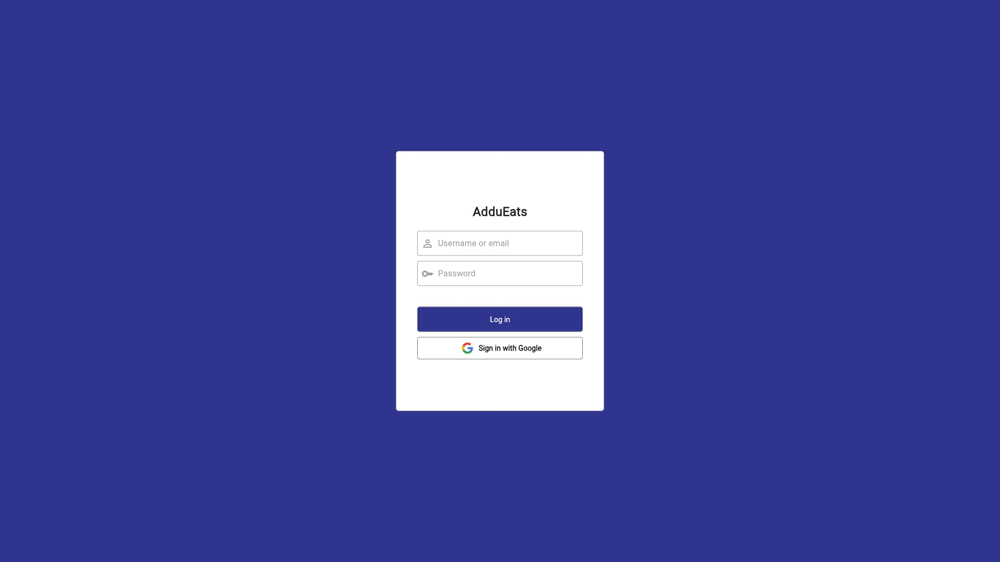

# AdduEats

[](https://flutter.dev/)
[](https://firebase.google.com/)

## Table of Contents

- [About](#about)
- [Features](#features)
- [Setup Guide](#setup-guide)
- [Contact](#contact)

## About

**AdduEats** is a Flutter-based platform designed to manage and support its accompanying mobile app. It leverages Firebase Authentication for secure user access, Firestore Database for efficient data management, and Firebase Storage for handling meal images. The platform allows users to add new meals, update meal details, and hide meals from the client app, offering seamless menu management to enhance the dining experience for campus users.

## Features

### Login

- Supports login via email or Google
- Firebase Authenticaiton



### Dashboard

- Displays all meals stored in Firestore Database
- Quickly set visibility of meals


### Add Meal

- Add meals with name, description, price, and image
- Set visibility


### Edit Meal

- Edit information of existing meals
- Set visibility


### Item Details

- Displays name, description, price, and image of the selected meal


## Setup Guide

1. **Clone the repository**

```bash
git clone https://github.com/RonBers/campus-dining-web.git
```

```bash
cd campus-dining-web
```

2. **Get package dependencies**

```bash
flutter pub get
```

3. **Run the application on Chrome**

```bash
flutter run
```

## Contact

- [Ron Bersabal](https://github.com/RonBers)
- [Adrianne Bulao](https://github.com/adriannebulao)
